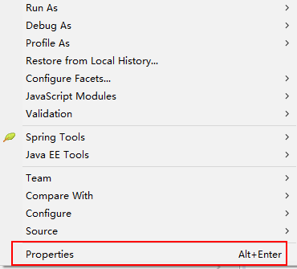
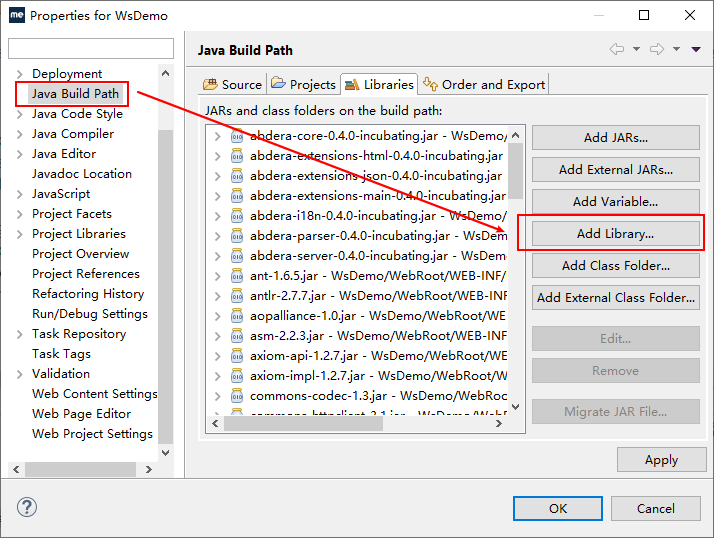
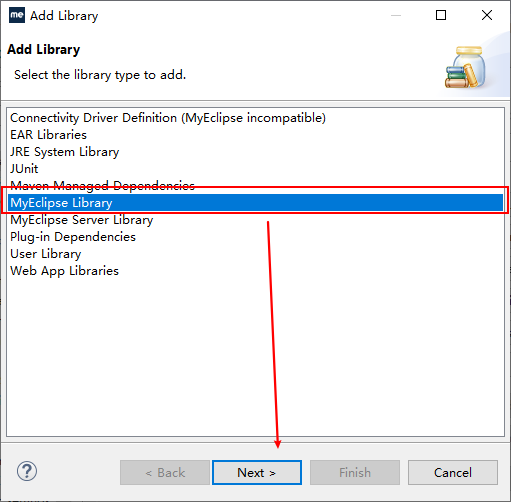
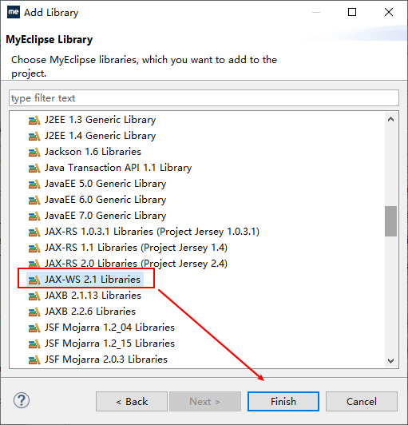
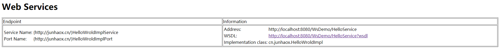

# 部署Webservice到Tomcat上

## 1.使用Myeclipse2017创建一个web工程

## 2.下载相关Jar包

到该网址下[下载](http://archive.apache.org/dist/cxf/)相关Jar包，cxf和jdk的对应关系见[官网](http://cxf.apache.org/faq.html)，将lib文件夹下的jar包粘贴至WebRoot下的lib目录下，并添加至类路径。

## 3.创建Webservice接口

1. 创建对外提供服务的接口

```java
public interface HelloWorld {
	public String sayHello(String name, Integer age);
}
```

2. 创建接口的实现类，对内实现业务逻辑

```java
import javax.jws.WebMethod;
import javax.jws.WebParam;
import javax.jws.WebResult;
import javax.jws.WebService;
import javax.jws.soap.SOAPBinding;

@WebService
@SOAPBinding(style = SOAPBinding.Style.RPC)
public class HelloWroldImpl implements HelloWorld {
	@Override
	@WebMethod
	@WebResult(name = "hello")
	public String sayHello(@WebParam(name = "name") String name, @WebParam(name = "age") Integer age) {
		if (age > 18) {
			return "hello " + name + " " + "成年人";
		} else {
			return "hello " + name + " " + "小屁孩";
		}
		
	}
}
```

## 4.编写相关配置文件

1. 在WEB-INF目录下创建`sun-jaxws.xml`文件用于描述发布的服务。

```xml
<?xml version="1.0" encoding="UTF-8"?>
<endpoints xmlns='http://java.sun.com/xml/ns/jax-ws/ri/runtime'
        version='2.0'>
<endpoint name='Hello' implementation='cn.junhaox.HelloWroldImpl' url-pattern='/HelloService' />
</endpoints>
```

2. 修改`web.xml`配置文件添加监听器，但是没有相关jar包，需要通过Myeclipse添加。

```xml
<?xml version="1.0" encoding="UTF-8"?>
<web-app xmlns:xsi="http://www.w3.org/2001/XMLSchema-instance" xmlns="http://java.sun.com/xml/ns/javaee" xsi:schemaLocation="http://java.sun.com/xml/ns/javaee http://java.sun.com/xml/ns/javaee/web-app_2_5.xsd" id="WebApp_ID" version="2.5">
  <display-name>WsDemo</display-name>
  <welcome-file-list>
    <welcome-file>index.jsp</welcome-file>
  </welcome-file-list>
  <listener>
    <listener-class>com.sun.xml.ws.transport.http.servlet.WSServletContextListener</listener-class>
  </listener>
 
  <servlet>
    <servlet-name>Hello</servlet-name>
    <servlet-class>com.sun.xml.ws.transport.http.servlet.WSServlet</servlet-class>
    <load-on-startup>2</load-on-startup>
  </servlet>
  <servlet-mapping>
    <servlet-name>Hello</servlet-name>
    <url-pattern>/HelloService</url-pattern>
  </servlet-mapping>
  
</web-app>
```

3. 添加Webservice监听器相关jar包。

右键工程 -> properties -> Java Build Path -> Add Library - Myeclipse Library，找到JAX-WS 2.1Libraries，然后Finish -> Apply -> OK









## 5.启动项目

访问`http://localhost:8080/WsDemo/HelloService`即可看到Webservice接口相关信息，访问`http://localhost:8080/WsDemo/HelloService?wsdl` 即可查看到接口的描述信息，至此Webservice部署到Tomcat结束。



## 6.客户端测试接口

在Myeclipse中新建普通工程，然后在src目录下右键 -> new -> other，搜索web service，选择Web Service Client，然后Next，将`http://localhost:8080/WsDemo/HelloService?wsdl` ，粘贴到WSDL URL，然后Next，直接Finish，刷新src即可看到接口文件。

新建测试类，测试Webservice接口。

```java
public class MainTest {
	public static void main(String[] args) {
		HelloWroldImplService service = new HelloWroldImplService();
		HelloWroldImpl helloWroldImplPort = service.getHelloWroldImplPort();
		String sayHello = helloWroldImplPort.sayHello("hello", 12);
		System.out.println(sayHello);
	}
}
```

当更新服务端业务逻辑代码(HelloWroldImpl)时，测试结果会随着服务端逻辑的改变而改变。

完！
