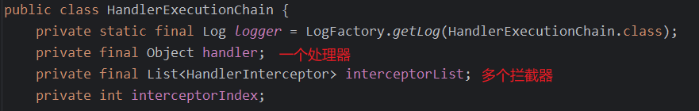

# 01

## 1.spring 中的 bean 线程安全吗

spring 中的 bean 有 6 中作用域：

- singleton，bean 是单例的，在 spring 容器中只有一个实例
- prototype，bean 是多例的，每次获取 bean 时创建

剩余 4 种存在于 web 环境下：

- request，每次请求都会创建新的 bean
- session，每次会话创建一个 bean
- application，在整个 spring web 项目生命周期中使用同一个 bean
- global session，类似于 application，在 portlet 环境下生效

在考虑 spring 中 bean 的线程安全问题时，如果 bean 的作用域是 prototype，request 一般来说就不存在线程安全问题了；如果 bean 的作用域是 singleton 或者 application 则要考虑 bean 的状态：无状态 bean 和有状态 bean，对于无状态 bean 一般来说对于它的成员变量的操作只涉及查询不涉及修改，这种 bean 就不存在线程安全问题；对于有状态 bean 一般来说对于它的成员变量的操作既涉及查询也涉及修改，那么它就可能存在线程安全问题；

基于此解决 spring bean 线程安全问题主要有三个方面：

- 将 bean 的作用域修改为 prototype 或者 request
- 避免在 bean 中定义需要进行修改的成员变量
- 在 Threadlocal 中来保存 bean 的成员变量

## 2.spring 中事务失效的情况

spring 中的声明式事务是基于 AOP 实现的，那么第一类问题就是所有导致 spring AOP 失效的情况都会导致事务失效：

1. 事务方法使用 private 修饰，AOP 动态地理无法代理 private 方法
2. 类没有被 spring 容器所管理，自然也就不会生成代理对象
3. 在本类中直接使用 this 调用方法，this 指代的对象并非代理对象，因此 AOP 会失效

第二类是关于`@Transactional`注解的使用问题：

4. 方法异常被捕获，spring 事务是基于异常来进行回滚的，如果异常没有正常抛出会导致事务无法正常回滚
5. rollbackFor 属性设置的有问题，默认值为 RuntimeException，如果设置的异常与实际抛出的异常不匹配也会导致不能正常回滚
6. 未设置 TransactionManager，spring boot 中是会自动配置好 TransactionManager，普通 spring 项目需要自己手动配置
7. 事务传播性设置有误，例如设置的传播性本身就不支持事务

第三类则是数据库本身的问题

8. 对应的数据库不支持事务

## 3.为什么使用 spring

1. spring 非常轻量，核心版本包只有 2MB
2. spring 支持 Ioc，能够对 bean 进行全生命周期的管理，然后通过 DI 进行依赖注入
3. spring 支持 AOP，提供面向切面编程，能够使开发者专注业务本身
4. spring 提供了非常灵活的 web 框架 spring mvc，这也是目前最主流的 web 开发框架
5. spring 提供了声明式事务管理，通过 AOP 实现事务的统一管理
6. spring 支持主流的数据访问，例如 JPA 、MyBatis
7. spring 中的测试非常方便，开发过程中就可以完成测试脚本的编写
8. spring 有完整的生态支持，几乎实现了全场景的覆盖，例如数据访问的 spring data、安全管理的 spring security、会话管理 spring session、微服务 spring cloud 等等
9. spring 社区活跃度非常高

## 4.spring 中的事务传播行为

spring 中的传播行为共有 7 种：

- REQUIRED：当前有事务就加入，没有就创建新事务
- SUPPORTS：当前有事务就加入，没有就以非事务方式运行
- REQUIRES_NEW：创建一个新的事务，如果当前有事务就将当前事务挂起
- NOT_SUPPORTED：以非事务方式运行，如果当前有事务就将当前事务挂起
- MANDATORY：强制以事务方式运行，如果当前没有事务则抛出异常
- NEVER：强制以非事务方式运行，如果当前存在事务则抛出异常
- NESTED：如果当前存在事务则创建一个当前事务的子事务，子事务的回滚不影响父事务，但是父事务的回滚会影响子事务；如果当前不存在事务则与 REQUIRED 一致

## 5.DispatcherServlet 处理流程

1. 请求到达 DispatcherServlet 之后将请求分发到处理器映射器，即 HandlerMapping
2. HandlerMapping 去根据 URL 找到对应的处理器及拦截器，然后返回一个处理器执行链HandlerExecutionChain
3. DispatcherServlet 依次执行处理器执行链中所有拦截器的 preHandle 方法
4. DispatcherServlet 调用处理器适配器 HandlerAdapter 去调用接口，由于我们定义接口的方式多种多样，最常用的是通过`@RequestMapping`及其衍生注解来定义接口；同时 spring mvc 还支持实现 Controller 接口来定义或者直接实现 HttpServlet 接口来定义。因此不论接口的定义方式是什么样的都统一通过 HandlerAdapter 来调用具体实现就非常灵活。HandlerAdapter 主要有四种，分别对应不同的接口实现方式：
   1. HttpRequestHandlerAdapter：主要适配静态资源处理器
   2. SimpleControllerHandlerAdapter：主要用来适配实现了 Controller 接口及其子接口的处理器
   3. RequestMappingHandlerAdapter：主要用来适配`@RequestMapping`及其衍生注解来定义的处理器
   4. SimpleServletHandlerAdapter：主要用来适配实现 HttpServlet 接口的处理器

HanderAdapter 将返回一个 ModelAndView，但是对于前后端分离的项目，接口直接返回给前端 JSON 数据，也即在 HanderAdapter 的 handle 方法中就将数据返回给前端了，此时返回的 ModelAndView 为 null

5. DispatcherServlet 继续执行拦截器中的 postHandle 方法
6. 对返回的 ModelAndView 进行处理，如果为 null 则没有后续流程了，表示数据已经返回给前端了；如果不为 null 则表示确实有页面需要返回给前端，此时会调用视图解析器 ViewResolver 对 ModelAndView 进行解析，解析之后会返回一个 View 对象，然后调用试图里面的 render 方法对视图进行渲染并返回给前端
7. 最后回到 DispatcherServlet 调用拦截器中的 afterCompletion 方法

总结 spring mvc 的 4 大核心组件：

- DispatcherServlet
- HandlerMapping
- HanderAdatper
- ViewResolver

## 6.生产 CPU 飙升排查

1. `top` 命令查看 CPU 最高的进程 id
2. `ps -mp 15025 -o THREAD,tid,time`命令查看该进程下 CPU 最高的线程 id
3. 线程 id 转 16 进制`printf "%x\n" 17169`
4. `jstack pid | grep 16进制 tid -A100 >> errr.log`查看该线程的线程栈

## 7.spring mvc 9 大核心组件

- HandlerMapping：处理器映射器，根据 url 找到对应的处理器
- HandlerAdapter：处理器适配器，处理器有多种定义方式，通过适配器方式实现统一调用处理器
- HanderExceptionResolver：异常解析器，当处理器执行异常时此组件负责兜底返回异常的 ModelAndView 可用作全局异常处理
- ViewResolver：试图解析器，解析试图并渲染
- RequestToViewNameTranslator：有时处理器并没有返回 View 也没有设置 ViewName，此时该组件就会从 request 中找到默认 View
- LocaleResolver：用于国际化支持，可以解析用户设置的区域信息，根据不同的区域设置显示不同的数据
- ThemeResolver：用于主题切换
- MultipartResolver：文件上传解析，可以解析请求中的文件，然后将文件参数处理后交给处理器进行处理
- FlashMapManager：当客户端跳转时可以进行参数传递

## 8.@Resource 和 @Autowired 的区别

1. 来源不同：@Resource 来自 JEE 由 JSR-250 规范提供；而 @Autowired 来自 spring
2. 默认装配方式不同：@Resource 是按照定义的变量名来寻找 bean，也可以指定 name 和 type 来寻找 bean；@Autowired 则是先根据类型，再根据变量名来寻找
3. 是否支持优先级不同：@Autowired 支持优先级配置，例如有多个类型相同的 bean，@Autowired 会优先注入指定了 @Primary 的 bean；@Resource 则不支持
4. 使用范围不同：@Autowired 可以用在构造器、方法、方法参数、成员变量等等；@Resource 只能用在类、方法和成员变量上
5. 参数不同：@Autowired 只有一个参数，required 表示是否自动注入；@Resource 有 7 个参数，常用的是 type 和 name 参数

## 9.spring AOP 理解

spring 中的 bean 都是通过 getBean 方法来获取的，在 getBean 的过程中创建 bean，bean 创建成功之后，spring 会根据配置的切面规则来判断当前 bean 是否符合切点规则，如果满足条件就会使用 ProxyFacotry 创建代理对象，并将代理对象加入 IoC 容器

AOP 的本质就是动态代理，不过手动编写动态代理太麻烦，spring 就将此过程封装了一下，是我们可以通过简单的配置就能使用

AOP 的使用非常广泛，例如日志记录、事务管理、安全控制、接口幂等性控制等等都可以通过 AOP 来实现。这些使用场景一般来讲都有一个共同点那就是需要配合自定义注解来使用

## 10.接口幂等性的理解

幂等性是指对于相同的参数无论调用多少次都能得到相同的结果，一般针对的是新增请求和更新请求，查询和删除请求时天然幂等的

接口幂等性和防止重复提交的区别：防止重复提交一般发生在客户端，可以在提交后将按钮灰置或者跳转结果页面；而接口幂等性是发生在服务端，是已经发生了重复提交，需要在服务端进行数据一致性保证

保证接口幂等性的几种方案：

- 唯一键：对于新增请求可以通过唯一键来判断新增是否已经成功，如果已经新增成功则直接返回
- 乐观锁：乐观锁主要针对更新请求，通过版本号来保证每次更新只有一个请求会成功
- token：每次请求携带一个全局唯一的 token，当请求到达后端时，将这个 token 放到 redis 中，如果有重复请求到达时直接判断 redis 中是否存在相同 token 即可
- 分布式锁：对于分布式应用重复请求可能会打到不同的接口，此时可以通过分布式锁来保证每个请求只会执行一次
