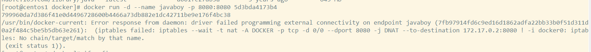
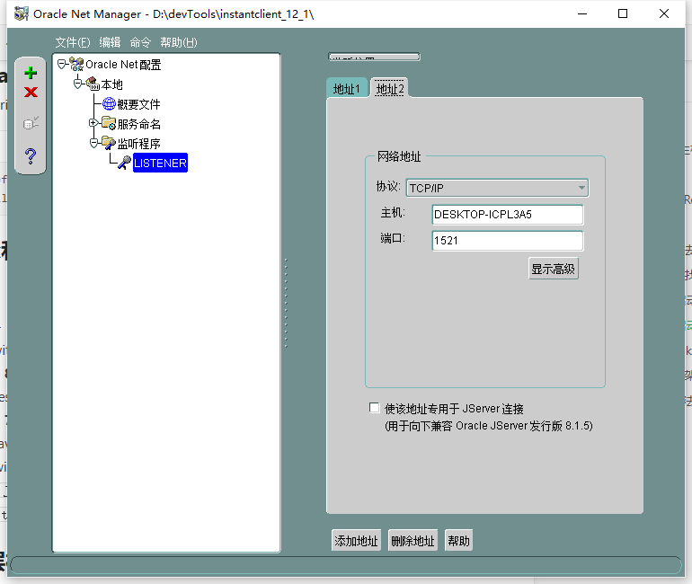
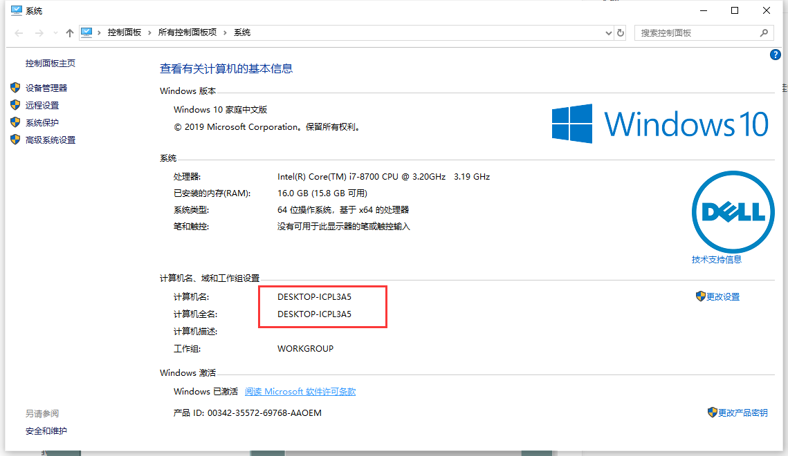
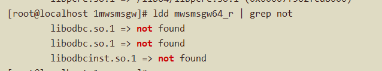
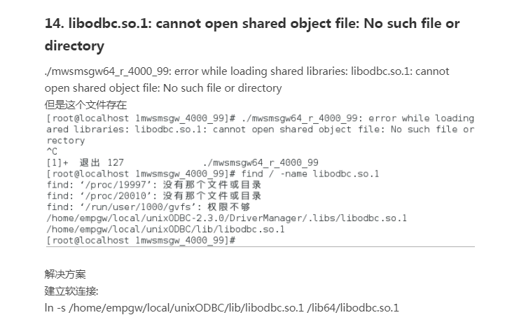

# 经验之谈（采坑日记）

## 1.Maven打包不走测试

```bash
mvn package -Dmaven.test.skip=true  
```

## 2.PowerShell连接远程主机报错

```shell
@@@@@@@@@@@@@@@@@@@@@@@@@@@@@@@@@@@@@@@@@@@@@@@@@@@@@@@@@@@
@    WARNING: REMOTE HOST IDENTIFICATION HAS CHANGED!     @
@@@@@@@@@@@@@@@@@@@@@@@@@@@@@@@@@@@@@@@@@@@@@@@@@@@@@@@@@@@
IT IS POSSIBLE THAT SOMEONE IS DOING SOMETHING NASTY!
Someone could be eavesdropping on you right now (man-in-the-middle attack)!
It is also possible that a host key has just been changed.
The fingerprint for the ECDSA key sent by the remote host is
SHA256:JF+d7Zc2DyFWkd86BhAnL5Tx5QNgdoqBZ8SowWgDbkA.
Please contact your system administrator.
Add correct host key in C:\\Users\\wjh/.ssh/known_hosts to get rid of this message.
Offending ECDSA key in C:\\Users\\wjh/.ssh/known_hosts:2
ECDSA host key for 192.168.1.110 has changed and you have requested strict checking.
Host key verification failed.
```

**解决方法** 

```shell
ssh-keygen -R 192.168.1.110
```

## 3.服务器配置外网

```shell
# vim /etc/sysconfig/network-scripts/ifcfg-ens33
TYPE=Ethernet
BOOTPROTO=none
DEFROUTE=yes
DNS1=114.114.114.114
IPV4_FAILURE_FATAL=yes
IPV6INIT=no
IPV6_AUTOCONF=yes
IPV6_DEFROUTE=yes
IPV6_PEERDNS=yes
IPV6_PEERROUTES=yes
IPV6_FAILURE_FATAL=no
IPV6_ADDR_GEN_MODE=stable-privacy
NAME=eth0
UUID=c587f502-1e9b-46ee-93d1-b39e56617fad
DEVICE=eth0
ONBOOT=yes
ZONE=public
IPADDR=192.169.1.93
PREFIX=22

IPADDR1=192.168.1.93
PREFIX1=22

GATEWAY=192.168.1.1
```

## 4.Docker启动MySQL和Redis将数据库文件挂载到本地

```bash
docker run -d -p 3306:3306 --name mysql5.7 -e MYSQL_ROOT_PASSWORD=root -v /data/docker_mysql/config/my.cnf:/etc/mysql/mysql.conf.d/mysqld.cnf -v /data/docker_mysql/err.log /var/log/mysql/error.log -v /data/docker_mysql/data:/var/lib/mysql --privileged=true b84d68d0a7db

docker run -p 6379:6379 -d  -v /data/docker_redis/data:/data aaf79d45ddb1  redis-server --requirepass 'wjhredis' --appendonly yes
```

## 5.Docker启动报错



**解决方法** 

[docker启动报错解决](https://www.jianshu.com/p/4005b39aba55)

```bash
pkill docker 

iptables -t nat -F 

ifconfig docker0 down 

brctl delbr docker0 

docker -d 

systemctl restart docker
重启docker服务
问题即可解决。。
```

## 6.Docker映射的端口无法访问

1. 防火墙是否关闭/对应端口是否打开，云服务器注意安全组
2. IP转发是否开启

```shell
sysctl net.ipv4.ip_forward
显示net.ipv4.ip_forward=0则表示未打开。
执行sysctl net.ipv4.ip_forward=1即可
```

3. 关闭IPTables `service iptables stop`

## 7.Tomcat7启动web.xml找不到

**[修改%TomcatHome%conf/context.xml](https://blog.csdn.net/lsfhack/article/details/81060249)**

```xml
<Context xmlBlockExternal="false">
```

## 8.查看Linux下Tomcat启动日志

**进入%TomcatHome/**​**logs/**

**执行**​`**tail -f catalina.out**`​ **，然后启动Tomcat即可实时查看启动日志**

## 9.解决Linux下Tomcat启动慢

进入%JAVA_HOME%/jre/lib/security/，修改第70行左右

```plain
70 # securerandom.source=file:/dev/urandom
72 securerandom.source=file:/dev/./urandom
```

## 10.webservice中cfx和jdk版本对应关系

**[官网介绍](http://cxf.apache.org/faq.html)**

**[cxf相关工具和包](http://archive.apache.org/dist/cxf/)**

**Can CXF run with JDK/ Java 9+ (10, 11)?**

Yes. CXF will support Java 9-11 with the next 3.3.x release.

**Can CXF run with JDK 1.8/Java 8?**

Yes. CXF supports Java 8. The latest 3.x version is built using JDK 1.8.

**Can CXF run with JDK 1.7/Java 7?**

Yes. CXF supports Java 7. Since Java 7 contains the 2.2.x versions of both JAXB and JAX-WS API jars, using CXF with Java 7 is much easier than with Java 6.

`CXF 3.2 no longer supports Java 7 and requires Java 8 or newer. Users are strongly encouraged to start moving to Java 8.`

## 11.公司封装的Dao层框架

conditionMap中key是类的属性名，不是表的字段名

## 12.windows下Oracle无法ip连接

在开始选项里面找到NET Manager，修改listener中的主机为计算机名即可





## 13.springboot中Mybatis使用XML编写SQL，XML无法找到

1. application.properties中

```plain
# mybatis 配置
mybatis.mapper-locations=classpath:cn/junhaox/micro_city2/mapper/xml/*.xml

# mybatis plus 配置
mybatis-plus.mapper-locations=classpath:cn/junhaox/studentmanager/mapper/xml/*.xml
```

2. mapper接口上添加@Mapper注解
3. pom文件中build节点下添加resources

```xml
<build>
  <resources>
    <resource>
      <directory>src/main/java</directory>
      <includes>
        <include>**/*.xml</include>
        <include>**/*.properties</include>
      </includes>
      <filtering>true</filtering>
    </resource>
    <resource>
      <directory>src/main/resources</directory>
      <includes>
        <include>**/*.xml</include>
        <include>**/*.properties</include>
      </includes>
      <filtering>true</filtering>
    </resource>
  </resources>
</build>
```

## 14.Jar包打补丁方法

1. 解压test.jar包，观察目录结构

```plain
需要替换的class文件的目录为
test\a\b\c\Person.class
```

2. 在jar包同级目录下新建文件夹`a\b\c`
3. 将新的`Person.class`文件放到新建的文件夹下
4. 执行命令`jar uvf test.jar a\b\c\Person.class`

`a\b\c\Person.class`为新class文件，执行该命令会自动替换jar包中的对应目录的文件

## 15.centos更改时区为东八区

`cp  /usr/share/zoneinfo/Asia/Shanghai  /etc/localtime`

## 16.开放端口映射

有时即使在宿主机进行了端口映射也会出现端口不通的情况，这是由于宿主机的端口转发没有打开，可以配置打开端口转发。

`vim /etc/sysctl.conf`

添加

`net.ipv4.ip_forward = 1`

重新加载

`sysctl -p`

## 17.docker挂载硬盘被拒绝

把宿主机的一个目录挂载到容器中的一个目录，当访问容器中的这个目录时，出现如下问题：

```plain
ls: cannot open directory .: Permission denied
```

无法访问目录，权限拒绝。该问题通常在centos7下出现。或者一个容器启动成功后，里面的服务无法成功访问，这是因为centos7中的安全模块selinux把权限禁掉了，一般的解决方案有以下两种：

（1）临时关闭selinux

直接在centos服务器上执行以下命令即可。执行完成以后建议重新docker run。

setenforce 0

（2）给容器加权限

在docker run时给该容器加权限，加上以下参数即可：

--privileged=true

一般都推荐使用这种方式。

## 18.SVN提示证书无法信任

`svn ls https://项目路径`

然后输入`p`

接下来可能会提示输入电脑密码和svn账户和密码

**svn检出代码指定用户名**

`svn checkout 项目全路径 [本地全路径] --username xxx`

## 19.远程取包地址

向日葵：

```plain
识别码：187341988
验证码：6799
```

## 20.Java 启动开启代理

```sql
-DproxySet=true -DproxyHost=127.0.0.1 -DproxyPort=9999
```

## 21.网关依赖存在却找不到





## 22.Maven多模块微服务打包

1. 在父模块 pom 添加如下配置，保证非 spring boot 模块正常打包

```xml
<build>
  <plugins>
    <plugin>
      <groupId>org.apache.maven.plugins</groupId>
      <artifactId>maven-compiler-plugin</artifactId>
    </plugin>
  </plugins>
</build>
```

2. 在 spring boot 模块 pom 添加如下配置（这里特指 spring boot 的模块为自定义父模块，而不是 spring-boot-starter-parent）

```xml
<build>
  <plugins>
    <plugin>
      <groupId>org.springframework.boot</groupId>
      <artifactId>spring-boot-maven-plugin</artifactId>
      <version>${spring-boot.version}</version>
      <configuration>
        <mainClass>cn.junhaox.storage.StorageApplication</mainClass>
      </configuration>
      <executions>
        <execution>
          <id>repackage</id>
          <goals>
            <goal>repackage</goal>
          </goals>
        </execution>
      </executions>
    </plugin>
  </plugins>
</build>
```

## 23.iptables 拒绝指定 url

```bash
iptables -I INPUT -m string --string "/debug/pprof" --algo bm -j DROP
# 查看 iptables 规则
iptables -nL INPUT --line-number
# 删除指定行号规则
iptables -D INPUT 1
```

## 24.Java 打包成可执行 jar

### 1.依赖包和 jar 包打成一个整体

pom.xml 添加如下打包配置：

```xml
<build>
    <plugins>
        <plugin>
            <groupId>org.apache.maven.plugins</groupId>
            <artifactId>maven-assembly-plugin</artifactId>
            <executions>
                <execution>
                    <phase>package</phase>
                    <goals>
                        <goal>single</goal>
                    </goals>
                    <configuration>
                        <archive>
                            <manifest>
                                <mainClass>
                                    com.iflytek.exec.Main01
                                </mainClass>
                            </manifest>
                        </archive>
                        <descriptorRefs>
                            <descriptorRef>jar-with-dependencies</descriptorRef>
                        </descriptorRefs>
                    </configuration>
                </execution>
            </executions>
        </plugin>
    </plugins>
</build>
```

通过`java -jar xxx-with-dependencies.jar aaa bbb ccc`即可执行指定 main 方法，`aaa bbb ccc`将作为参数传递给 main 方法。

如果 jar 包有多个 main 方法，可以通过`java -cp xxx-with-dependencies.jar xxx.xxx.MainClass aaa bbb ccc`来执行指定 main 方法`aaa bbb ccc`将作为参数传递给`xxx.xxx.MainClass`的 main 方法。

### 2.jar 包和依赖包分开

pom.xml 打包配置如下：

```xml
<build>
    <finalName>${project.artifactId}-${project.version}</finalName>
    <plugins>
        <plugin>
            <groupId>org.apache.maven.plugins</groupId>
            <artifactId>maven-jar-plugin</artifactId>
            <configuration>
                <archive>
                    <manifest>
                        <addClasspath>true</addClasspath>
                        <classpathPrefix>lib/</classpathPrefix>
                        <mainClass>com.iflytek.exec.Main02</mainClass>
                    </manifest>
                    <!--此处添加本地依赖到classpath，对应为pom里的${artifactId}-${version}.jar-->
                    <!--                        <manifestEntries>-->
                    <!--                            <Class-Path>lib/msg-send-tool-1.0.jar lib/scfop-open-ap
                    <!--                        </manifestEntries>-->
                </archive>
                <excludes>
                    <exclude>application.yml</exclude>
                </excludes>
            </configuration>
        </plugin>
        <!--整体打包-->
        <!--            <plugin>
                        <groupId>org.springframework.boot</groupId>
                        <artifactId>spring-boot-maven-plugin</artifactId>
                        <configuration>
                            <includeSystemScope>true</includeSystemScope>
                        </configuration>
                    </plugin>-->
        <!--拷贝依赖到jar外面的lib目录-->
        <plugin>
            <groupId>org.apache.maven.plugins</groupId>
            <artifactId>maven-dependency-plugin</artifactId>
            <executions>
                <execution>
                    <id>copy-lib</id>
                    <phase>prepare-package</phase>
                    <goals>
                        <goal>copy-dependencies</goal>
                    </goals>
                    <configuration>
                        <outputDirectory>${project.build.directory}/lib</outputDirectory>
                        <overWriteReleases>false</overWriteReleases>
                        <overWriteSnapshots>false</overWriteSnapshots>
                        <overWriteIfNewer>true</overWriteIfNewer>
                    </configuration>
                </execution>
            </executions>
        </plugin>
        <plugin>
            <artifactId>maven-assembly-plugin</artifactId>
            <configuration>
                <appendAssemblyId>false</appendAssemblyId>
                <descriptors>
                    <descriptor>src/main/resources/assembly.xml</descriptor>
                </descriptors>
            </configuration>
            <executions>
                <execution>
                    <id>make-assembly</id>
                    <phase>package</phase>
                    <goals>
                        <goal>single</goal>
                    </goals>
                </execution>
            </executions>
        </plugin>
    </plugins>
</build>
```

assembly.xml 配置如下：

```xml
<assembly xmlns="http://maven.apache.org/plugins/maven-assembly-plugin/assembly/1.1.3"
          xmlns:xsi="http://www.w3.org/2001/XMLSchema-instance"
          xsi:schemaLocation="http://maven.apache.org/plugins/maven-assembly-plugin/assembly/1.1.3 http://maven.apache.org/xsd/assembly-1.1.3.xsd">
    <id>package</id>
    <formats>
        <format>tar.gz</format>
    </formats>
    <includeBaseDirectory>true</includeBaseDirectory>
    <fileSets>
        <!--拷贝配置文件-->
        <fileSet>
            <directory>${basedir}/src/main/resources</directory>
            <includes>
                <include>*.yml</include>
            </includes>
            <filtered>true</filtered>
            <outputDirectory>${file.separator}config</outputDirectory>
        </fileSet>
        <fileSet>
            <directory>${project.build.directory}</directory>
            <outputDirectory>${file.separator}</outputDirectory>
            <includes>
                <include>*.jar</include>
            </includes>
        </fileSet>
        <!--拷贝依赖包-->
        <fileSet>
            <directory>${project.build.directory}/lib</directory>
            <outputDirectory>${file.separator}/lib</outputDirectory>
            <includes>
                <include>*.jar</include>
            </includes>
        </fileSet>
    </fileSets>
</assembly>
```

## 25.ffmpeg 对音频进行转换

```shell
# mp3 转 16K wav
./ffmpeg -i 40.mp3 -ac 2 -ar 16000 16000.wav

# mp3 转 8K wav
./ffmpeg -i 40.mp3 -ac 2 -ar 8000 8000.wav

# 8K mp3 转 16K mp3
./ffmpeg -i 40.mp3 -b:a 16k -ac 2 -ar 16000 test.mp3

# mp3 转 alaw wav
ffmpeg -i 40.mp3 -c:a pcm_alaw -ar 8000 1alaw.wav

# mp3 转 ulaw wav
ffmpeg -i 40.mp3 -c:a pcm_mulaw -ar 8000 1ulaw.wav
```
