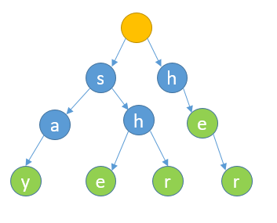
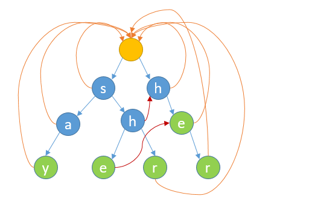
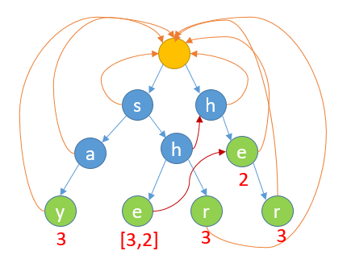

# AC 自动机

## 1.实现原理

AC 自动机是一种基于前缀树的查找算法，可以在只遍历一次字符串的情况下找到所有的关键词。AC 自动机匹配算法的关键在于构建 fail 指针，其构建方法遵循以下原则：

- root 节点的 fail 指针为 null
- root 节点的子节点的 fail 指针都指向 root 节点
- 按层次依次构建 fail 指针
- 若当前节点的父节点的 fail 指针下的节点没有与当前节点值相等的节点，则当前节点的 fail 指针指向 root 节点；否则指向与该值相等的节点。

例如针对以下关键词：`say、she、shr、her、he`其构建的 trie 树如下：



根据以上规则构建 fail 指针后如下：

其中绿色节点表示结束节点，为了方便计算，可以将关键词长度记录到结束节点上，用来表示回溯的字符串长度：



由上可以看出，当某节点为结束节点且其 fail 指针节点也为结束节点时，需要将 fail 指针节点的值拷贝一份到当前节点。

## 2.Java 代码构建 AC 自动机

```java
public class ACAutomaton {
    /**
     * trie 树节点
     */
    static class ACNode {
        char ch;  // 当前节点的字符
        int[] lenArr;  // 是否是一个模式串的结束节点
        ACNode fail;  // 失败指针
        Map<Character, ACNode> children;  // 子节点

        public ACNode(char ch) {
            this.ch = ch;
            this.lenArr = new int[]{};
            this.fail = null;
            this.children = new HashMap<>();
        }
    }

    /**
     * 根节点
     */
    private final ACNode root;

    public ACAutomaton() {
        root = new ACNode('/');
    }

    /**
     * 构建 trie 树
     * @param pattern
     */
    public void addPattern(String pattern) {
        ACNode current = root;

        for (char ch : pattern.toCharArray()) {
            current.children.putIfAbsent(ch, new ACNode(ch));
            current = current.children.get(ch);
        }

        current.lenArr = new int[]{pattern.length()};
    }

    /**
     * 构建失败指针
     */
    public void buildFailurePointer() {
        Queue<ACNode> queue = new LinkedList<>();

        // 将根节点的所有子节点入队
        for (ACNode child : root.children.values()) {
            child.fail = root;
            queue.add(child);
        }
        while (!queue.isEmpty()) {
            ACNode current = queue.poll();

            for (ACNode child : current.children.values()) {
                char ch = child.ch;
                ACNode temp = current.fail;
                // 在失败指针链中寻找下一个节点
                while (temp != null && !temp.children.containsKey(ch)) {
                    temp = temp.fail;
                }

                if (temp == null) {
                    child.fail = root;
                } else {
                    child.fail = temp.children.get(ch);
                    if (child.lenArr.length > 0 && child.fail.lenArr.length > 0) {
                        child.lenArr = ArrayUtil.addAll(child.lenArr, child.fail.lenArr);
                    }

                }
                // 将该节点的子节点入队
                queue.add(child);
            }
        }
    }

    /**
     * 在文本中查找匹配的模式串
     * @param text
     * @return
     */
    public List<String> search(String text) {
        List<String> result = new ArrayList<>();
        ACNode current = root;

        for (int i = 0; i < text.length(); i++) {
            char ch = text.charAt(i);

            while (current != null && !current.children.containsKey(ch)) {
                current = current.fail;
            }

            if (current == null) {
                current = root;
            } else {
                current = current.children.get(ch);
            }

            if (current == null) {
                current = root;
            } else if (current.lenArr.length > 0) {
                for (int i1 : current.lenArr) {
                    result.add(text.substring(i - i1 + 1, i + 1));
                }
            }
        }

        return result;
    }

}
```

## 3.测试用例

```java
public static void main(String[] args) {
    ACAutomaton automaton = new ACAutomaton();
    automaton.addPattern("say");
    automaton.addPattern("she");
    automaton.addPattern("shr");
    automaton.addPattern("her");
    automaton.addPattern("he");

    automaton.buildFailurePointer();

    String text = "sherhsay";
    List<String> matches = automaton.search(text);

    System.out.println("匹配的模式串:");
    for (String match : matches) {
        System.out.println(match);
    }
}
/*
匹配的模式串:
she
he
her
say
*/
```
