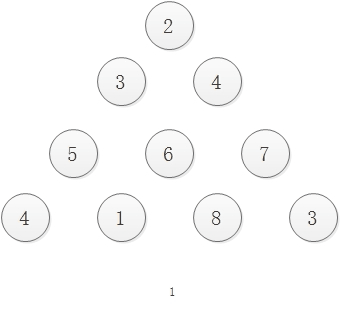
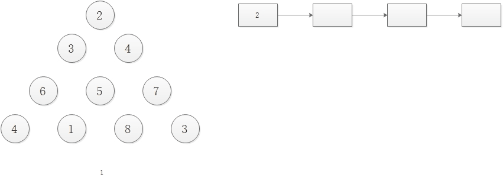

# 三角形最小路径和

## 1. 题目描述

> 给定一个三角形，找出自顶向下的最小路径和。每一步只能移动到下一行中相邻的结点上。

> 相邻的结点 在这里指的是 下标 与 上一层结点下标 相同或者等于 上一层结点下标 + 1 的两个结点。

> 例如，给定三角形：

> [

>     [2],

>    [3,4],

>   [6,5,7],

>  [4,1,8,3]

> ]

> 自顶向下的最小路径和为 11（即，2 + 3 + 5 + 1 = 11）。

## 2. 解题思路I

采用自底向上的方式，从倒数第二层开始，逐层原地更新dp数组（原来的三角形数组） `dp[i][j] = min(dp[i][j], dp[i][j + 1]) + c[i][j]`，该表达式表示第i层的第j个元素的最小路径和等于下一层的相邻节点中的最小路径和加上本节点的值，最终dp[0][0]位置的值即为最短路径和，如下图：

    

### 2.1Java代码

```java
public int minimumTotal(List<List<Integer>> triangle) {
    int row = triangle.size();
    if (row <= 0) return 0;

    for (int i = row - 2; i >= 0; i--) {
        List<Integer> col = triangle.get(i);
        for (int j = 0; j < col.size(); j++) {
            int temp = triangle.get(i).get(j);
            temp += Math.min(triangle.get(i + 1).get(j), triangle.get(i + 1).get(j + 1));
            triangle.get(i).set(j, temp);
        }
    }
    return triangle.get(0).get(0);

}
```

## 3. 解题思路II

采用自顶向下的方式，由于是自顶向下最小路径和一定是在最后一层出现，故可以采用一个一维的dp数组来记录每一层各个节点的路径和，但是dp数组的值需要从右向左更新，因为在更新dp[j]的值得时候是需要dp[j]和dp[j - 1]的值进行判断的。



### 3.1Java代码

```java
public int minimumTotal2(List<List<Integer>> triangle) {
    int row = triangle.size();
    int[] dp = new int[row];
    dp[0] = triangle.get(0).get(0);
    for (int i = 1; i < row; i++) {
        dp[i] = triangle.get(i).get(i) + dp[i - 1];
        for (int j = i - 1; j > 0; j--) {
            dp[j] = triangle.get(i).get(j) + Math.min(dp[j - 1], dp[j]);
        }
        dp[0] += triangle.get(i).get(0);
    }
    int minVal = Integer.MAX_VALUE;
    for (int i = 0; i < row; i++) {
        minVal = Math.min(dp[i], minVal);
    }
    return minVal;
}
```
